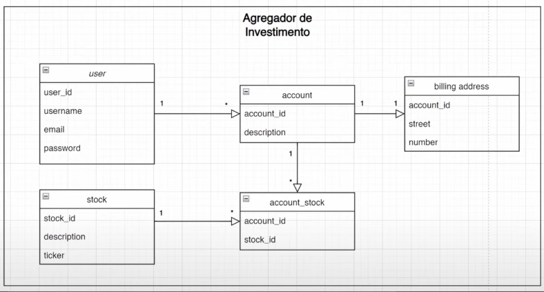

# 📊 Agregador de Investimentos

Este projeto tem como objetivo permitir o gerenciamento de **usuários**, **contas bancárias** e **ações (stocks)**, possibilitando associar ações às contas e controlar investimentos de maneira simples.
---

---

## 📌 Sumário

- [👤 Usuários](#-usuários)
  - [Criar usuário](#criar-usuário)
  - [Buscar usuário por ID](#buscar-usuário-por-id)
  - [Listar todos os usuários](#listar-todos-os-usuários)
  - [Atualizar usuário](#atualizar-usuário)
  - [Deletar usuário](#deletar-usuário)
- [🏦 Contas](#-contas)
  - [Criar conta para usuário](#criar-conta-para-usuário)
  - [Listar contas do usuário](#listar-contas-do-usuário)
- [📈 Ações (Stocks)](#-ações-stocks)
  - [Criar ação](#criar-ação)
- [🔗 Associações entre Conta e Ações](#-associações-entre-conta-e-ações)
  - [Associar ação a uma conta](#associar-ação-a-uma-conta)
  - [Listar ações de uma conta](#listar-ações-de-uma-conta)

---

## 👤 Usuários

### Criar usuário

- **POST** `/v1/users`

#### 🧾 Requisição:
```json
{
  "username": "emanuel",
  "email": "emanuel@gmail.com",
  "password": "1123"
}
```

#### ✅ Resposta:
```json
{
  "userId": "e1b5d9a8-2c14-410c-bd1e-cbc980f47ed7",
  "username": "emanuel",
  "email": "emanuel@gmail.com",
  "password": "1123",
  "creationTimestamp": "2025-04-21T16:51:53.435780Z",
  "updatedTimestamp": "2025-04-21T16:51:53.436318Z",
  "accounts": []
}
```

---

### Buscar usuário por ID

- **GET** `/v1/users/{userId}`

#### ✅ Resposta:
```json
{
  "userId": "e1b5d9a8-2c14-410c-bd1e-cbc980f47ed7",
  "username": "emanuel",
  "email": "emanuel@gmail.com",
  "password": "1123",
  "creationTimestamp": "2025-04-21T16:51:53.435780Z",
  "updatedTimestamp": "2025-04-21T16:51:53.436318Z",
  "accounts": []
}
```

---

### Listar todos os usuários

- **GET** `/v1/users`

#### ✅ Resposta:
```json
[
  {
    "userId": "e1b5d9a8-2c14-410c-bd1e-cbc980f47ed7",
    "username": "emanuel",
    "email": "emanuel@gmail.com",
    "password": "1123",
    "creationTimestamp": "2025-04-21T16:51:53.435780Z",
    "updatedTimestamp": "2025-04-21T16:51:53.436318Z",
    "accounts": []
  }
]
```

---

### Atualizar usuário

- **PUT** `/v1/users/{userId}`

#### 🧾 Requisição:
```json
{
  "username": "novoUsername",
  "email": "novoemail@gmail.com"
}
```

#### ✅ Resposta:
- `204 No Content`

---

### Deletar usuário

- **DELETE** `/v1/users/{userId}`

#### ✅ Resposta:
- `204 No Content`

---

## 🏦 Contas

### Criar conta para usuário

- **POST** `/v1/users/{userId}/accounts`

#### 🧾 Requisição:
```json
{
  "description": "conta",
  "street": "rua",
  "number": 2
}
```

#### ✅ Resposta:
- `200 OK`

---

### Listar contas do usuário

- **GET** `/v1/users/{userId}/accounts`

#### ✅ Resposta:
```json
[
  {
    "accountId": "033f955e-0846-4946-bac0-de73079344fb",
    "description": "conta"
  },
  {
    "accountId": "8e586d29-0f22-4733-bae9-cae8e097b34a",
    "description": "conta"
  }
]
```

---

## 📈 Ações (Stocks)

### Criar ação

- **POST** `/v1/stocks`

#### 🧾 Requisição:
```json
{
  "stockId": "PETR4",
  "description": "Conta de Investimento"
}
```

#### ✅ Resposta:
- `200 OK`

---

## 🔗 Associações entre Conta e Ações

### Associar ação a uma conta

- **POST** `/v1/accounts/{accountId}/stocks`

#### 🧾 Requisição:
```json
{
  "stockId": "PETR4",
  "quantity": 4
}
```

#### ✅ Resposta:
- `200 OK`

---

### Listar ações de uma conta

- **GET** `/v1/accounts/{accountId}/stocks`

#### ✅ Resposta:
```json
[
  {
    "stockId": "PETR4",
    "quantity": 4,
    "total": 123.4
  }
]
```
